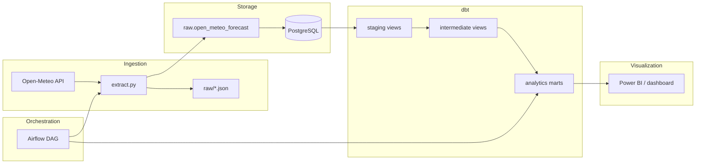
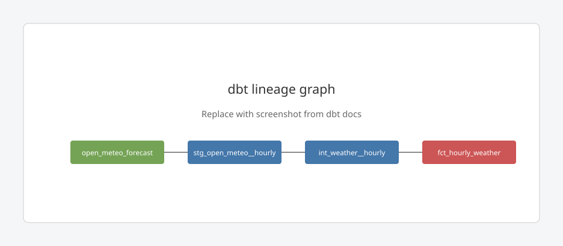
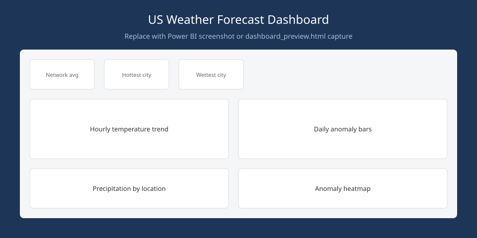

# Weather Data Pipeline

An end-to-end analytics pipeline that ingests Open-Meteo forecast data for seven US cities, lands it in PostgreSQL, transforms it with dbt, orchestrates it with Airflow, and visualizes it in Power BI.

Built as a portfolio project to demonstrate the full modern data stack — extraction, warehousing, transformation, orchestration, and BI — running locally with Docker.

---

## Architecture



**Data flow in plain English:**

1. **extract.py** calls the Open-Meteo API for seven locations, saves each response as a JSON file on disk, then inserts the full payload into Postgres.
2. **dbt** reads the raw JSONB column, flattens nested hourly/daily arrays into typed columns, deduplicates reruns, joins location metadata, and builds analytics-ready tables.
3. **Airflow** runs the pipeline on a daily schedule: extract → validate load → dbt run → dbt test.
4. **Power BI** connects directly to the `analytics` schema — no further transformation in the BI layer.

A draw.io-friendly version of this diagram lives in [`docs/architecture.mmd`](docs/architecture.mmd) (Mermaid source you can paste into [mermaid.live](https://mermaid.live) or Excalidraw plugins).

---

## Why these tools?

| Tool | Role | Why this choice |
|------|------|-----------------|
| **PostgreSQL** | Warehouse + raw landing zone | Free, runs in Docker, native JSONB for nested API payloads, and Power BI connects to it directly. A cloud warehouse (Snowflake, BigQuery) would add cost and account setup with no benefit at this scale (~1,200 hourly rows per run). |
| **Python + extract.py** | Ingestion | Simple, explicit control over API retries, per-location error handling, and a disk backup (`raw/`) before the DB load. Keeps extraction "dumb" — no business logic in the ingest layer. |
| **dbt** | Transformation | SQL-based, testable, version-controlled transforms. Separates *how data is cleaned* from *how it is loaded*. |
| **Airflow** | Orchestration | Schedules daily runs, retries flaky API calls, validates loads before transformation, and gives a visual audit trail of pipeline health. |
| **Power BI** | Visualization | Native Postgres connector; connects straight to dbt marts without exporting CSVs or building a separate semantic layer. |

### dbt layering

| Layer | Schema | Materialization | Purpose |
|-------|--------|-----------------|---------|
| **Staging** | `staging` | Views | Parse raw JSONB — flatten hourly/daily arrays, cast types, one row per time step |
| **Intermediate** | `intermediate` | Views | Business logic — deduplicate reruns, join location seed, rolling averages |
| **Marts** | `analytics` | Tables | Analyst-ready facts (`fct_hourly_weather`, `fct_daily_weather`) and derived summaries (`temperature_anomalies`, `daily_temperature_summary`) |

Staging stays close to the source shape; marts are denormalized for BI consumption. Intermediate is where reruns and joins happen so staging models stay simple.

---

## What this project handles

### Nested JSON flattening

Open-Meteo returns parallel arrays inside JSON (`hourly.time[]`, `hourly.temperature_2m[]`, …). Staging models use PostgreSQL `generate_series` + JSONB array indexing to unnest these into one row per hour/day:

```sql
-- stg_open_meteo__hourly.sql (simplified)
lateral generate_series(1, jsonb_array_length(response_body -> 'hourly' -> 'time')) as idx
-- then: response_body -> 'hourly' -> 'temperature_2m' ->> (idx - 1)
```

The raw JSON is never mutated — parsing lives entirely in dbt.

### Multi-location extraction

Seven US cities are fetched in a single run (LA, NYC, Chicago, Miami, Seattle, Denver, Austin). Each location is independent: API timeouts or DB errors for one city are logged and skipped; the others continue. Every run shares a `load_id` UUID for lineage.

### Backfill vs. incremental loading

This pipeline uses **append-only full extracts**, not incremental API deltas:

- Each scheduled run fetches a fresh 7-day forecast per location and inserts new rows.
- Raw JSON files on disk (`raw/weather_{city}_{date}.json`) act as a replay buffer — if Postgres load fails, you can re-insert without re-calling the API.
- dbt **deduplicates at read time** (`DISTINCT ON … ORDER BY ingested_at DESC`) so rerunning extract on the same day does not double-count in marts.

Incremental loading would make sense at higher volume or with a paid API quota; for a daily 7-location forecast portfolio project, append + dedup is simpler and easier to debug.

---

## Repository layout

```
weather_data_project/
├── extract.py                 # Open-Meteo → JSON files → raw.open_meteo_forecast
├── docker-compose.yml         # PostgreSQL (weather_postgres)
├── db/init/                   # Schema bootstrap SQL
├── weather_dbt/               # dbt project (staging → intermediate → marts)
├── airflow/                   # Airflow Docker stack + weather_pipeline DAG
├── powerbi/                   # Power BI connection file + dashboard guide
└── docs/screenshots/          # Checkpoint screenshots (see below)
```

---

## Quick start

**Prerequisites:** Docker Desktop, Python 3.11+, [dbt-core](https://docs.getdbt.com/docs/core/installation) with `dbt-postgres` adapter.

### 1. Clone and start Postgres

```bash
git clone <your-repo-url>
cd weather_data_project
docker compose up -d
```

Postgres listens on `localhost:5432` with credentials `weather` / `weather` / `weather_db`. Init scripts create the `raw` and `analytics` schemas automatically.

### 2. Configure dbt

```bash
cp weather_dbt/profiles.example.yml weather_dbt/profiles.yml
```

### 3. Install Python dependencies and extract

```bash
pip install -r requirements.txt
python extract.py
```

Verify the load:

```bash
docker compose exec postgres psql -U weather -d weather_db \
  -c "SELECT count(*), max(ingested_at) FROM raw.open_meteo_forecast;"
```

### 4. Transform and test with dbt

```bash
cd weather_dbt
dbt deps
dbt seed
dbt run
dbt test
```

### 5. (Optional) Start Airflow and run the full pipeline

```bash
cd airflow
docker compose build
docker compose up airflow-init    # first time only
docker compose up -d
```

Open http://localhost:8080 (login: `airflow` / `airflow`), trigger the **weather_pipeline** DAG, or:

```bash
docker compose exec airflow-scheduler airflow dags trigger weather_pipeline
```

### 6. (Optional) Dashboard

- **Power BI (Windows):** open `powerbi/weather_postgres.pbids`, connect to `analytics` tables. See [`powerbi/README.md`](powerbi/README.md).
- **Browser preview (Mac/Linux):**

```bash
cd powerbi
pip install -r requirements.txt
python generate_dashboard_preview.py
open dashboard_preview.html
```

---

## Analytics tables (Power BI source)

| Table | Description |
|-------|-------------|
| `analytics.fct_hourly_weather` | Hourly observations — temp, humidity, precip, wind (7 cities × 168 hours) |
| `analytics.fct_daily_weather` | Daily aggregates — high/low, precip sum, UV, sunshine |
| `analytics.temperature_anomalies` | Each city's deviation from the cross-location average |
| `analytics.daily_temperature_summary` | Network-wide daily headline stats (hottest/wettest city) |
| `analytics.locations` | Seed reference table (city, state, lat/lon) |

---

## Screenshots

> Add your checkpoint images to `docs/screenshots/` — see [`docs/screenshots/README.md`](docs/screenshots/README.md) for capture instructions.

### Airflow DAG — end-to-end success


### dbt lineage



Generate locally: `cd weather_dbt && dbt docs generate && dbt docs serve`

### Dashboard



---

## Pipeline operations

| Action | Command |
|--------|---------|
| Re-extract data | `python extract.py` |
| Rebuild models | `cd weather_dbt && dbt run` |
| Run tests | `cd weather_dbt && dbt test` |
| Trigger Airflow DAG | `docker compose exec airflow-scheduler airflow dags trigger weather_pipeline` |
| Inspect raw JSON | `ls raw/` |
| Query marts | `docker compose exec postgres psql -U weather -d weather_db -c "SELECT * FROM analytics.fct_daily_weather LIMIT 5;"` |

---

## Environment variables

All components read the same Postgres settings (defaults shown):

| Variable | Default |
|----------|---------|
| `POSTGRES_HOST` | `localhost` (use `weather_postgres` inside Docker network) |
| `POSTGRES_PORT` | `5432` |
| `POSTGRES_USER` | `weather` |
| `POSTGRES_PASSWORD` | `weather` |
| `POSTGRES_DB` | `weather_db` |

Copy `.env.example` to `.env` to override locally (optional).

---

## License

MIT — use freely for learning and portfolio purposes.
